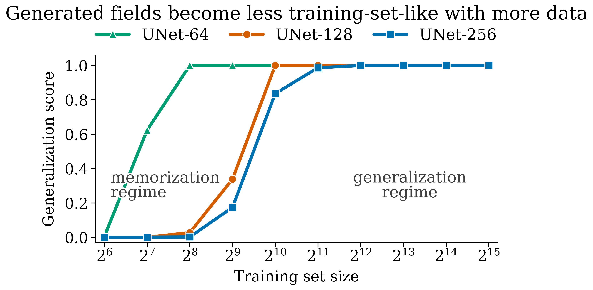
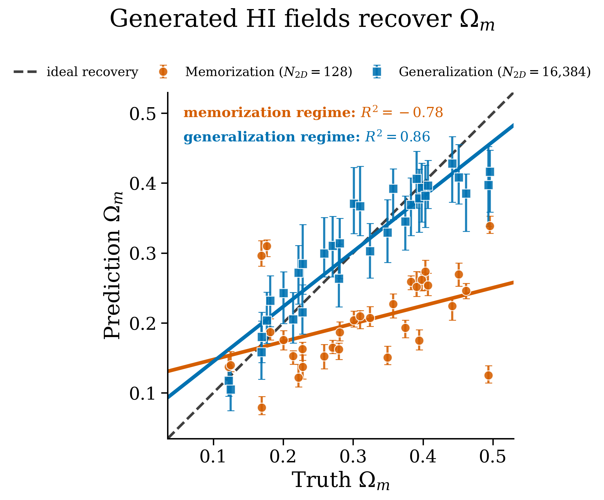

# From Memorization to Generalization: Diffusion Models for Cosmology

**When can you trust a generative model as a scientific prior?** This project maps the
memorization-to-generalization transition in diffusion models trained on cosmological
fields, and shows what crossing it — or failing to — does to the science downstream.

Presented as a poster at the **2026 Deep Learning for Science School, Lawrence Berkeley
National Laboratory** ([`poster/astroai_poster.pdf`](poster/astroai_poster.pdf)).
Work with Nicholas Kern and Dragan Huterer, University of Michigan.

## The problem

Trained diffusion models are increasingly used as priors over cosmological fields for
simulation-based inference. That use has a failure mode worse than low sample quality:
if the model has memorized its training simulations, its score function concentrates on
near-copies of training data. Every standard check still passes — samples look
excellent, summary statistics match — but inference built on that prior is biased toward
the training cosmologies while *looking* precise. The dangerous regime is the one where
nothing appears wrong.

So the question is not "are the samples good?" but "is the model copying?" — and for a
given model size, how much training data it takes before it stops.

## What we did

We trained conditional diffusion models — UNets of three depths and DiTs — on 128×128
neutral-hydrogen maps from the CAMELS IllustrisTNG suite (1,000 simulations, ~128k maps,
conditioned on six cosmological parameters), sweeping the training-set size from 2⁶ to
2¹⁵ maps.

Memorization is measured directly rather than assumed: each generated map is matched to
its closest training map (cosine similarity in pixel, PCA, and SSCD feature spaces) and
scored against a threshold set by how similar training maps are *to each other* — the
95th percentile of train-vs-train closest-match similarity. A generated map more similar
than that is a copy in the only sense that matters. The fraction of non-copies is the
generalization score.

## What we found

**The transition is sharp, and larger models memorize longer.** Below a critical
training-set size the model reproduces near-copies of its training maps; above it,
generated fields become genuinely novel. The threshold grows with model capacity —
deeper UNets need more simulations before they stop copying.

**Memorization silently corrupts inference.** We recover cosmological parameters from
generated maps with a frozen VGG16 probe trained on real simulations only (held-out
R² = 0.91 on Ωm). In the memorization regime, recovered parameters cluster tightly but
are biased toward the training values — calibration slope ≈ 0.26 against ideal recovery.
Past the transition the slope reaches ≈ 0.79, with the recovered Ωm consistent with the
requested value ~95% of the time. Precision without accuracy is exactly the failure an
overconfident prior produces, and it is invisible to visual inspection.

**Fidelity and practicality.** Generated fields reproduce the two-point statistics of
the real maps, with training dynamics learning large scales first and filling in small
scales later. Swapping the 500-step DDPM sampler for a 50-step DPM-Solver cuts sampling
cost 8× without degrading the maps.

The practitioner's takeaway: before using a generative model as a prior, measure its
generalization score against its own training set. Bigger models are not safer — they
memorize at larger dataset sizes, and the biased regime is the one that looks best.

## Repository contents

- [`poster/`](poster/) — the DL4Sci poster and its figures
- [`notebooks/`](notebooks/) — training/evaluation notebooks, including the DiT
  generalization results behind the transition figure
- `src/`, `configs/`, `scripts/` — training and evaluation code, currently being
  consolidated here from the research codebase (Jul 2026)

## Data

[CAMELS Multifield Dataset](https://camels-multifield-dataset.readthedocs.io/)
(IllustrisTNG; Villaescusa-Navarro et al. 2021): 1,000 simulations, 128 slices each,
neutral-hydrogen maps at 128×128.
